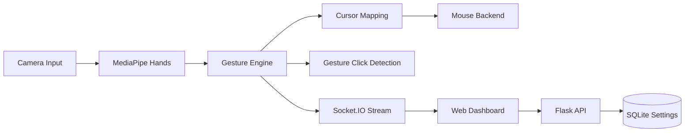

<div align="center">

# WayToAGI Gesture Control

Real-time hand-tracking mouse control system for desktop interaction.

[](https://www.python.org/)
[](https://flask.palletsprojects.com/)
[](https://ai.google.dev/edge/mediapipe/solutions/vision/hand_landmarker)
[](https://github.com/sudo-yf/hackathon2510/actions)
[](LICENSE)

</div>

## Overview

WayToAGI Gesture Control 是一个面向实时人机交互的手势控制系统：通过摄像头捕获手部关键点，完成光标映射与点击手势识别，并通过 Web UI 提供低延迟可视化与参数调优能力。

## Table of Contents

- [Overview](#overview)
- [Key Features](#key-features)
- [System Architecture](#system-architecture)
- [Quick Start](#quick-start)
- [Docker Deployment](#docker-deployment)
- [Runtime Configuration](#runtime-configuration)
- [HTTP API](#http-api)
- [Project Structure](#project-structure)
- [Design References](#design-references)

## Key Features

- 21-point hand landmark tracking (MediaPipe Hands)
- 非线性光标映射（中心稳态 + 边缘加速）
- 手势点击触发（左键 / 右键）
- Socket.IO 实时视频帧与状态推送
- SQLite 参数持久化（平滑系数、灵敏度、边缘加速）
- 可在无系统鼠标注入模式下运行（`DISABLE_MOUSE=1`）

## System Architecture



## Quick Start

### 1. Install Dependencies (uv)

```bash
uv sync
```

### 2. Run Service

```bash
uv run python app.py
```

Open: [http://localhost:5000](http://localhost:5000)

### 3. Quality Gates

```bash
make lint
make test
make check
```

## Docker Deployment

```bash
docker build -t waytoagi-gesture:latest .
```

```bash
docker run --rm -it \
  -p 5000:5000 \
  --device=/dev/video0:/dev/video0 \
  -e DISABLE_MOUSE=1 \
  waytoagi-gesture:latest
```

## Runtime Configuration

| Env | Default | Description |
|---|---|---|
| `HOST` | `0.0.0.0` | 服务监听地址 |
| `PORT` | `5000` | 服务端口 |
| `CAMERA_INDEX` | `0` | 摄像头索引 |
| `FRAME_WIDTH` | `1280` | 采集宽度 |
| `FRAME_HEIGHT` | `720` | 采集高度 |
| `FRAME_FPS` | `30` | 采样帧率 |
| `CORS_ORIGIN` | `*` | 前端跨域来源 |
| `SETTINGS_DB_PATH` | `data/waytoagi.db` | SQLite 配置存储路径 |
| `DISABLE_MOUSE` | `0` | 禁用真实鼠标注入（1 为禁用） |

## HTTP API

| Method | Path | Description |
|---|---|---|
| `GET` | `/healthz` | 服务与摄像头状态 |
| `GET` | `/api/settings` | 读取当前控制参数 |
| `POST` | `/api/settings` | 更新控制参数 |
| `POST` | `/api/camera/start` | 启动摄像头处理线程 |
| `POST` | `/api/camera/stop` | 停止摄像头处理线程 |
| `POST` | `/api/mouse/toggle` | 切换鼠标控制开关 |
| `POST` | `/api/settings/flip` | 切换镜像翻转 |

## Project Structure

```text
hackathon2510/
├── app.py
├── src/waytoagi_gesture/
│   ├── web.py
│   ├── service.py
│   ├── config.py
│   ├── settings_store.py
│   └── static/
├── tests/
├── Dockerfile
├── Makefile
├── pyproject.toml
└── LICENSE
```

## Design References

- [MediaPipe](https://github.com/google-ai-edge/mediapipe)
- [OpenCV](https://github.com/opencv/opencv)
- [Flask](https://github.com/pallets/flask)
- [Flask-SocketIO](https://github.com/miguelgrinberg/Flask-SocketIO)

