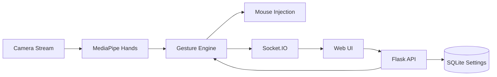

# WayToAGI Gesture Control


WayToAGI Hackathon 作品。  
一个面向实时交互的手势控制系统：摄像头识别手部关键点，后端完成动作映射，前端提供全屏可视化与低延迟控制面板。

## Highlights

- Real-time 手势识别（21 landmarks）
- 鼠标映射算法（中心增稳 + 边缘加速）
- 动作触发（左键/右键点击）
- 设置持久化（SQLite）
- Docker 运行与 `uv` 环境管理

## Architecture



## Project Layout

```text
hackathon2510/
├── app.py
├── src/waytoagi_gesture/
│   ├── config.py
│   ├── service.py
│   ├── settings_store.py
│   ├── web.py
│   └── static/
├── tests/
├── pyproject.toml
├── Makefile
├── Dockerfile
└── RELEASE.md
```

## Quick Start

```bash
uv sync
uv run python app.py
```

Open [http://localhost:5000](http://localhost:5000)

## Local Quality Gates

```bash
make lint
make test
make check
```

## Docker

```bash
docker build -t waytoagi-gesture:latest .
```

```bash
docker run --rm -it \
  -p 5000:5000 \
  --device=/dev/video0:/dev/video0 \
  -e DISABLE_MOUSE=1 \
  waytoagi-gesture:latest
```

## Configuration

| Key | Default | Description |
|---|---|---|
| `HOST` | `0.0.0.0` | 服务监听地址 |
| `PORT` | `5000` | 服务端口 |
| `CAMERA_INDEX` | `0` | 摄像头索引 |
| `FRAME_WIDTH` | `1280` | 视频宽度 |
| `FRAME_HEIGHT` | `720` | 视频高度 |
| `FRAME_FPS` | `30` | 视频帧率 |
| `SETTINGS_DB_PATH` | `data/waytoagi.db` | SQLite 配置库 |
| `DISABLE_MOUSE` | `0` | 禁用系统鼠标注入 |

## API

- `GET /healthz`
- `GET /api/settings`
- `POST /api/settings`
- `POST /api/camera/start`
- `POST /api/camera/stop`
- `POST /api/mouse/toggle`
- `POST /api/settings/flip`

## Release Policy

See [RELEASE.md](RELEASE.md)
