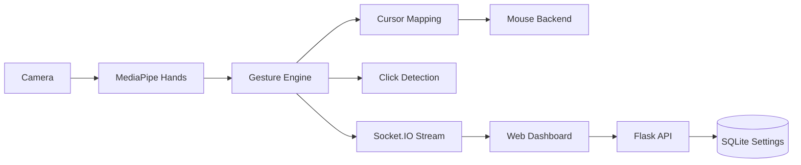

<div align="center">

# WayToAGI Gesture Control

面向桌面交互场景的实时手势控制系统

[](https://www.python.org/)
[](https://flask.palletsprojects.com/)
[](https://ai.google.dev/edge/mediapipe/solutions/vision/hand_landmarker)
[](https://github.com/sudo-yf/hackathon2510/actions)
[](LICENSE)

</div>

## 项目简介

WayToAGI Gesture Control 将摄像头手部追踪、手势识别、光标映射与 Web 可视化控制台整合为一个完整系统，适用于交互演示、无接触控制、课程实验与 Hackathon 原型验证。

## 核心亮点

- 基于 MediaPipe Hands 的 21 点手部关键点跟踪
- 非线性光标映射（中心稳态、边缘加速）
- 手势点击触发（Left Click / Right Click）
- Socket.IO 实时帧推送与状态同步
- SQLite 参数持久化（平滑、灵敏度、边缘增益）
- 支持 `DISABLE_MOUSE` 安全模式（仅演示，不注入系统鼠标）

## 系统架构



## 快速开始

### 1. 安装依赖（uv）

```bash
uv sync
cp .env.example .env
```

### 2. 启动服务

```bash
uv run python app.py
```

浏览器访问：[http://localhost:5000](http://localhost:5000)

### 3. 质量检查

```bash
make lint
make test
make check
```

### 4. 运行前自检

```bash
make doctor
```

## 容器部署

构建镜像：

```bash
make docker-build
```

运行容器：

```bash
make docker-run
```

或使用 Compose：

```bash
docker compose up --build
```

## 运行配置

| 环境变量 | 默认值 | 说明 |
|---|---|---|
| `HOST` | `0.0.0.0` | 服务监听地址 |
| `PORT` | `5000` | 服务端口 |
| `CAMERA_INDEX` | `0` | 摄像头索引 |
| `FRAME_WIDTH` | `1280` | 视频宽度 |
| `FRAME_HEIGHT` | `720` | 视频高度 |
| `FRAME_FPS` | `30` | 视频帧率 |
| `CORS_ORIGIN` | `*` | CORS 允许来源 |
| `SETTINGS_DB_PATH` | `data/waytoagi.db` | SQLite 配置存储路径 |
| `DISABLE_MOUSE` | `0` | 1 表示禁用系统鼠标注入 |

## HTTP API

| Method | Path | 说明 |
|---|---|---|
| `GET` | `/healthz` | 健康状态与运行状态 |
| `GET` | `/api/settings` | 读取参数 |
| `POST` | `/api/settings` | 更新参数 |
| `POST` | `/api/camera/start` | 启动摄像头线程 |
| `POST` | `/api/camera/stop` | 停止摄像头线程 |
| `POST` | `/api/mouse/toggle` | 切换鼠标控制开关 |
| `POST` | `/api/settings/flip` | 切换画面镜像 |

## 目录结构

```text
hackathon2510/
├── app.py
├── src/waytoagi_gesture/
│   ├── web.py
│   ├── service.py
│   ├── config.py
│   ├── settings_store.py
│   └── static/
├── tests/
├── Dockerfile
├── docker-compose.yml
├── Makefile
├── pyproject.toml
└── LICENSE
```

## 参考项目

- [MediaPipe](https://github.com/google-ai-edge/mediapipe)
- [OpenCV](https://github.com/opencv/opencv)
- [Flask](https://github.com/pallets/flask)
- [Flask-SocketIO](https://github.com/miguelgrinberg/Flask-SocketIO)

## 发布打包

```bash
make release-bundle
```
